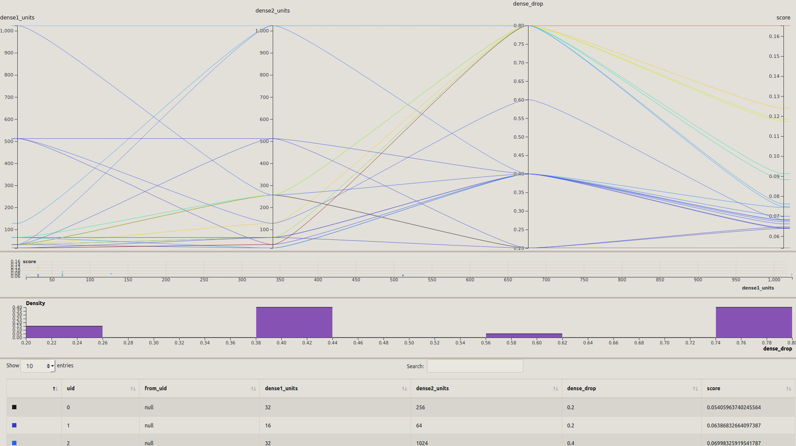

# Keras Tuner to Hiplot

This script traverses a project directory generated by a [Keras Tuner](https://keras-team.github.io/keras-tuner/) tuner and creates a CSV file that can directly be consumed by [HiPlot](https://facebookresearch.github.io/hiplot/) for visualization of results. Inspired by [this post](https://medium.com/datadriveninvestor/neural-network-hyper-parameter-tuning-with-keras-tuner-and-hiplot-7637677821fa).

## Install
You will need to have HiPlot installed (python 3.6 or above)

`pip install hiplot`

For easy of use you can install the script in `~/bin/` or `/usr/local/bin/`.

`cp keras-tuner-hiplot/kt2hip.py ~/bin/`

## Usage
1. Navigate to your project folder and issue `kt2hip.py`, or directly

    `kt2hip.py /path/to/keras-tuner/project`

    This will create a `hiplot.csv` file in that folder and print its path to stdout.

2. `hiplot` on a terminal. Leave it running.

3. Open a web browser and go to `http://127.0.0.1:5005/` (or alternative location used by HiPlot server).

    Paste the path to the `hiplot.csv` file in the text box on top of the webpage and press enter.

